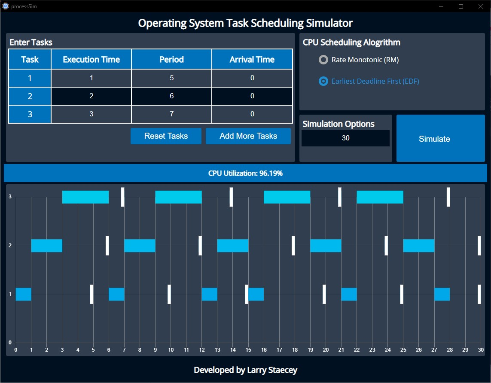

# processSim
Simulate operating system scheduling algorithms with input task arrival and period then produce the execution timeline. 

Algorithms Implemented:
* Rate monotonic
* Earliest deadline first

 
 

  

 
 

# Libraries Used
* [Eel: Python library for HTML/JS GUI apps](https://github.com/samuelhwilliams/Eel)
* [ChartJS: HTML5 charts](https://github.com/chartjs/Chart.js)
